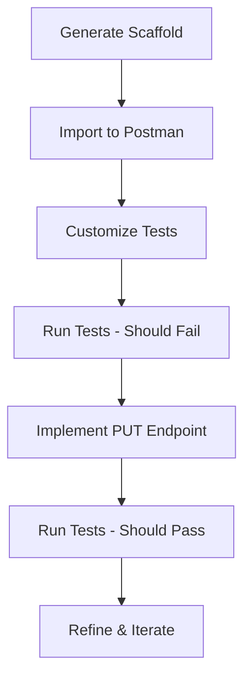

# PUT Endpoint Scaffolding - Project Summary
**Finance API - TDD Test Template System**

## Project Overview

Created a complete system for scaffolding PUT endpoint tests in the Finance API following TDD principles.

**Date**: October 6, 2025  
**Primary Use Case**: TM-180924 - Finance - Add PUT apInvoices/apInvoiceId

---

## Deliverables

### 1. **Analysis Document**
**File**: `PUT-Endpoint-Template-Analysis.md`

Comprehensive analysis of existing PUT endpoints including:
- 7 endpoints analyzed (checks, currencyRates, driverDeductions, driverPayments, glAccounts, interlinerPayables, taxes)
- Common folder structure patterns
- Standard test request types
- Test script patterns
- Variable naming conventions
- Request body patterns

**Key Findings**:
- All PUT endpoints follow consistent folder structure: `{resourceId}/PUT/200` and `{resourceId}/PUT/4xx/invalidBusinessLogic`
- Standard success tests: minimal fields, openAPI, $select, blank string
- Error tests use `tm_utils` helper functions
- Pre-request scripts create test data via POST
- Test scripts are minimal for 200 responses, comprehensive for 4xx

### 2. **Scaffolding Script**
**File**: `New-PutEndpointScaffold.ps1`

PowerShell script that generates complete folder structure and template requests.

**Features**:
- Creates folder hierarchy (resourceId → PUT → 200/4xx → invalidBusinessLogic)
- Generates template requests with placeholders
- Supports custom test names
- Includes default success and error tests
- Outputs JSON file for import
- Dry-run mode for preview

**Parameters**:
- Required: ApiKey, CollectionUid, EndpointName, ResourceIdName
- Optional: SuccessTests, ErrorTests, ParentFolderId, DryRun

**Usage Example**:
```powershell
.\New-PutEndpointScaffold.ps1 `
    -ApiKey "PMAK-..." `
    -CollectionUid "8229908-..." `
    -EndpointName "apInvoices" `
    -ResourceIdName "apInvoiceId" `
    -SuccessTests @("minimal fields", "vendor update") `
    -ErrorTests @("invoice is posted", "invalid vendorId") `
    -DryRun
```

### 3. **Quick Start Guide**
**File**: `PUT-Endpoint-Quick-Start.md`

Step-by-step guide for using the scaffolding system including:
- Complete walkthrough for TM-180924 (PUT apInvoices)
- Customization instructions
- Variable setup requirements
- Sample request bodies
- TDD workflow
- Troubleshooting tips

### 4. **Generated Scaffold**
**File**: `PUT-apInvoices-Scaffold.json`

Example scaffold generated for `PUT apInvoices/:apInvoiceId` with:
- 7 success tests (200 folder)
- 6 error tests (4xx/invalidBusinessLogic folder)
- Template request bodies
- Placeholder scripts
- Standard URL structure

---

## Generated Structure for PUT apInvoices

```
📁 apInvoiceId
  📁 PUT
    📁 200
      ✓ minimal fields
      ✓ Request body based on openAPI
      ✓ $select
      ✓ blank string
      ✓ vendor update
      ✓ invoice date update
      ✓ amounts update
    📁 4xx
      📁 invalidBusinessLogic
        ✓ invoice is posted - no update allowed
        ✓ invalid vendorId
        ✓ invalid glAccount
        ✓ duplicate invoice number
        ✓ random invalidDBValue
        ✓ 409 - Resource Conflict
```

**Total Requests Generated**: 13

---

## Success Tests (200 Folder)

| Test Name | Purpose | Template Included |
|-----------|---------|-------------------|
| minimal fields | Update with only required fields | ✅ |
| Request body based on openAPI | Full schema update | ✅ |
| $select | Field selection in response | ✅ |
| blank string | Empty string handling | ✅ |
| vendor update | Change vendor reference | ✅ Custom |
| invoice date update | Update date field | ✅ Custom |
| amounts update | Update invoice amounts | ✅ Custom |

---

## Error Tests (4xx Folder)

| Test Name | Purpose | Test Script Included |
|-----------|---------|----------------------|
| invoice is posted - no update allowed | Business rule validation | ✅ tm_utils |
| invalid vendorId | Invalid reference | ✅ tm_utils |
| invalid glAccount | Invalid GL account | ✅ tm_utils |
| duplicate invoice number | Uniqueness violation | ✅ tm_utils |
| random invalidDBValue | Generic validation | ✅ tm_utils |
| 409 - Resource Conflict | Concurrent update | ✅ Status check |

---

## Template Request Structure

Each generated request includes:

```json
{
  "name": "Test Name",
  "event": [
    {
      "listen": "test",
      "script": {
        "exec": ["// Test script or tm_utils function"],
        "type": "text/javascript"
      }
    },
    {
      "listen": "prerequest",
      "script": {
        "exec": ["// Setup script with TODO placeholders"],
        "type": "text/javascript"
      }
    }
  ],
  "request": {
    "method": "PUT",
    "header": [],
    "body": {
      "mode": "raw",
      "raw": "{\n    // TODO: Customize request body\n}",
      "options": {
        "raw": {
          "language": "json"
        }
      }
    },
    "url": {
      "raw": "{{DOMAIN}}/apInvoices/{{apInvoiceId}}",
      "host": ["{{DOMAIN}}"],
      "path": ["apInvoices", "{{apInvoiceId}}"]
    }
  }
}
```

---

## Customization Required

After generating the scaffold, you need to:

### 1. Update Request Bodies
Replace TODO placeholders with actual fields from OpenAPI spec:
```json
// Template
{
    "field1": "value1"
}

// Actual
{
    "vendorId": {{VENDOR_ID}},
    "invoiceAmount": 1000.00,
    "invoiceDate": "{{$isoTimestamp}}"
}
```

### 2. Update Pre-request Scripts
Add data setup logic:
```javascript
// Create test invoice
const postBody = {
    vendorId: pm.variables.get('VENDOR_ID'),
    invoiceNumber: `TEST-${Date.now()}`,
    invoiceAmount: 100.00
};

pm.sendRequest({
    url: `${pm.environment.get('DOMAIN')}/apInvoices`,
    method: 'POST',
    // ... rest of request
}, (err, response) => {
    const jsonData = response.json();
    pm.globals.set('temp_apInvoiceId', jsonData.apInvoices[0].apInvoiceId);
});
```

### 3. Update Test Scripts
Customize error messages:
```javascript
// Template
tm_utils.testInvalidBusinessLogicResponse("Expected error message");

// Actual
tm_utils.testInvalidBusinessLogicResponse("Cannot update a posted invoice");
```

### 4. Set Up Variables
Add required variables to collection/environment:
```javascript
DOMAIN = "https://tde-truckmate.tmwcloud.com/fin/finance"
TRUCKMATE_API_KEY = "..."
AP_INVOICE_ID = 2
VENDOR_ID = 1
GL_ACCOUNT = "00-5000"
```

---

## TDD Workflow



### Phase 1: Test Creation (TDD)
1. ✅ Run scaffold script
2. ⏳ Import generated JSON
3. ⏳ Customize request bodies
4. ⏳ Update pre-request scripts
5. ⏳ Update test scripts
6. ⏳ Set up variables

### Phase 2: Implementation
7. ⏳ Run tests (all should fail - no implementation yet)
8. ⏳ Implement PUT endpoint in backend
9. ⏳ Run tests again (should start passing)
10. ⏳ Fix failing tests/implementation

### Phase 3: Refinement
11. ⏳ Add additional edge case tests
12. ⏳ Refine error messages
13. ⏳ Document any deviations
14. ⏳ Final validation

---

## Benefits of This Approach

1. **Consistency**: All PUT endpoints follow the same structure
2. **Speed**: Generate complete test structure in seconds
3. **TDD**: Tests created before implementation
4. **Coverage**: Standard tests ensure comprehensive validation
5. **Maintainability**: Common patterns make updates easier
6. **Documentation**: Generated structure serves as documentation

---

## Comparison: Manual vs. Scaffolded

| Aspect | Manual | Scaffolded |
|--------|--------|------------|
| Time to create 13 requests | ~2 hours | ~5 minutes |
| Consistency across endpoints | Variable | Guaranteed |
| Missing standard tests | Common | Rare |
| Documentation | Often lacking | Built-in |
| TDD approach | Optional | Enforced |
| Customization | Full | Full |

---

## Future Enhancements

### Short Term
- [ ] Direct Postman API integration (skip manual import)
- [ ] Automatic variable detection
- [ ] OpenAPI schema import for request bodies

### Medium Term
- [ ] Test data generation from schemas
- [ ] Batch scaffolding for multiple endpoints
- [ ] Integration with Jira for test case mapping

### Long Term
- [ ] AI-powered test case generation
- [ ] Automated test maintenance
- [ ] Cross-endpoint consistency validation

---

## Files Location

All files are in: `C:\Users\dbatchelor\Documents\SCRIPTING\modules\apiPostman\postmanAPI\`

- `PUT-Endpoint-Template-Analysis.md` - Analysis
- `PUT-Endpoint-Quick-Start.md` - Quick start guide
- `PUT-Endpoint-Scaffold-Summary.md` - This summary
- `PUT-apInvoices-Scaffold.json` - Generated example
- `../New-PutEndpointScaffold.ps1` - Scaffolding script

---

## Ready for TM-180924

The system is now ready to use for:
- **Jira**: TM-180924
- **Endpoint**: PUT /apInvoices/:apInvoiceId
- **Collection**: Finance Functional Tests
- **Next Step**: Import `PUT-apInvoices-Scaffold.json` and customize

---

## Questions?

Refer to:
1. `PUT-Endpoint-Quick-Start.md` for step-by-step instructions
2. `PUT-Endpoint-Template-Analysis.md` for pattern details
3. Existing PUT endpoints in Finance collection for examples

---

**Status**: ✅ Complete and ready to use  
**Generated**: October 6, 2025  
**For**: TM-180924 - Finance - Add PUT apInvoices/apInvoiceId

